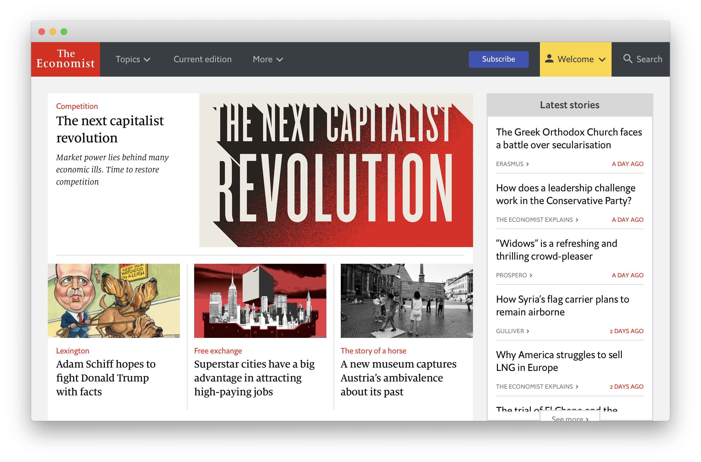

# Keynes

A painless [The Economist](https://economist.com) reader for macOS.

This application simply wraps The Economist website into a Webview for an
easier reading.

More features to come.

## Disclaimer

This application was created for my personal use, I share the source code
because I believe in Free Software and I have a profound respect for The
Economist and mean no harm to the journal or any of its employee. Please
contact me for any question.

All product and company names are trademarks™ or registered® trademarks of
their respective holders. Use of them does not imply any affiliation with or
endorsement by them. 

